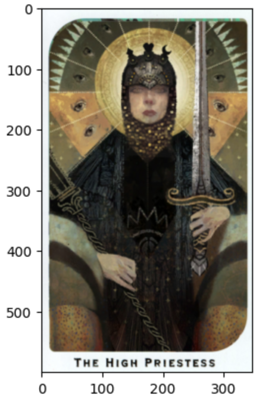

# TarotCV
Tarot Card Interpretation using Computer Vision ,ML and Chatbot
I trained a model using TensorFlow to detect the suit and number of Tarot cards given their image. I create the dataset by taking pictures of each card, then perform pre-processing and data augmentation using rotate, zoom, brighten, and shear functions. The final dataset consists of 39000, 180x180 grayscale images. I then train a convolutional neural network to classify the card images. 

## Dataset
The standard modern tarot deck consists of 78 cards divided into two groups: the major arcana, which has 22 cards, also known as trumps, and the minor arcana, which has 56 cards.To create the preliminary dataset, I simply take a single picture of each card in a 78 card deck, like so:

I then perform data augmentation using various transformation functions later on.

## Data augmentation functions
 I experiment with various data augmentation functions built into TensorFlow. Feel free to adjust the values and/or add additional augmentation functions. Please see the TensorFlow.Keras ImageDataGenerator api page for more details (https://www.tensorflow.org/api_docs/python/tf/keras/preprocessing/image/ImageDataGenerator).
 

## Training and results
During training, the training and validation accuracy both reached 99.9%. Let’s take a closer look at the loss and accuracy during the training process through the following plots.

Finally, I run the trained model on a sample of test set images. The plot below displays the sample image and the prediction of the model.

